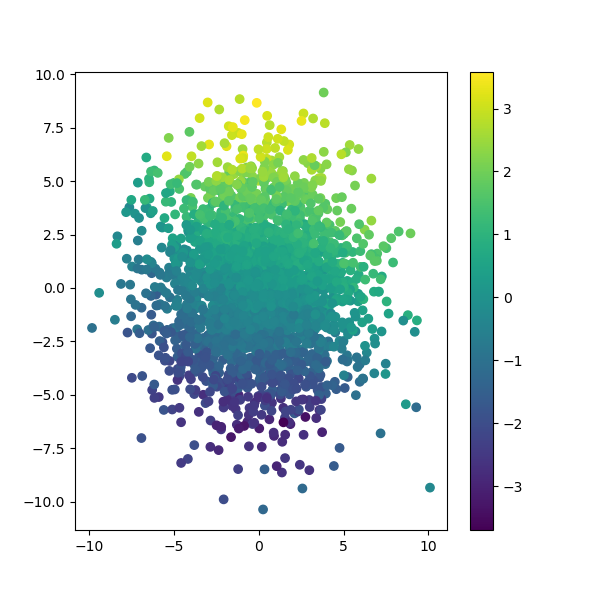
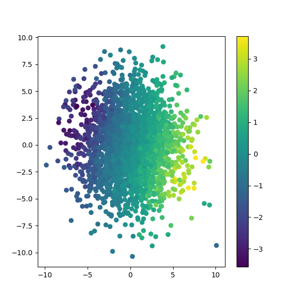

# Variational-Autoencoder

## Autoencoder
An autoencoder an ANN (Artificial Neural Network) used to learn efficient data codings in an unsupervised manner. 
The aim of an autoencoder is to learn a representation (encoding) for a set of data, typically for dimensionality reduction,
by training the network to ignore signal “noise”. Along with the reduction side, a reconstructing side is learnt, where the
autoencoder tries to generate from the reduced encoding a representation as close as possible to its original input, hence its name.
Several variants exist to the basic model, with the aim of forcing the learned representations of the input to assume useful properties.

## Variational Autoencoder
Variational autoencoders (VAEs) are autoencoders that tackle the problem of the latent space irregularity by making 
the encoder return a distribution over the latent space instead of a single point and by adding in the loss function a
regularisation term over that returned distribution in order to ensure a better organisation of the latent space.

## Idea of project

   
   
    <figcaption>Left: Evolution simulation of mixed strategy Nash Equilibrium  Right: Evolution simulation of pure strategy Nash Equilibrium</figcaption>

