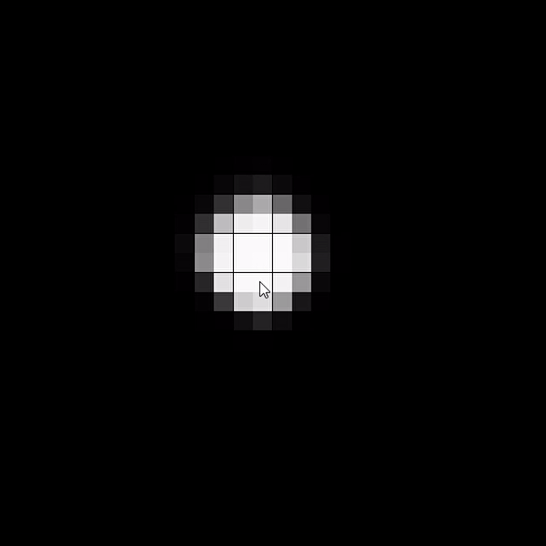

# Variational-Autoencoder

## Autoencoder
An autoencoder an ANN (Artificial Neural Network) used to learn efficient data codings in an unsupervised manner. 
The aim of an autoencoder is to learn a representation (encoding) for a set of data, typically for dimensionality reduction,
by training the network to ignore signal “noise”. Along with the reduction side, a reconstructing side is learnt, where the
autoencoder tries to generate from the reduced encoding a representation as close as possible to its original input, hence its name.
Several variants exist to the basic model, with the aim of forcing the learned representations of the input to assume useful properties.

The data flow within the network is the following: The input data is fed into the encoder, which outputs a latent vector. The dimension of the latent vector can be lower than the dimension of the input layer. By feeding the latent vector into the decoder and fixing the output values to be the same as the input values, the latent vector is forced to contain a low dimensional representation of the input vector, as the latent vector when fed to the decoder has to reproduce the input vector (see Figure)

   
    <figcaption>Autoencoder Topology</figcaption>

## Variational Autoencoder
Variational autoencoders (VAEs) are autoencoders that tackle the problem of the latent space irregularity by making 
the encoder return a distribution over the latent space instead of a single point and by adding in the loss function a
regularisation term over that returned distribution in order to ensure a better organisation of the latent space.

The data flow within the network is the following: The input data is fed into the encoder, which outputs a latent vector. The latent vector is separated into two vectors, a mean vector and a standard deviation vector. Together, they form a new layer which is a sampling with the means and standard deviations from the latent vector. Then, the new latent later is fed into the decoder, which has as outputs the inputs given to the decoder (see Figure).

   
    <figcaption>Variational Autoencoder Topology</figcaption>

## Goal of project

### 1. Create autoencoder
1. Create a set of low resolution (28x28 pixels) images (matrices) of circles having centers in random coordinates.
2. Create an encoder Artificial Neural Network. The encoder receives the images as input and outputs a vector having a low dimensionality (latent vector).
3. Create a decodder Artificial Neural Network. The decoder receives the latent vector as input and outputs an image of the same dimensionality as the input image.
3. Create the autoencoder by concatenating the encoder and the decoder.
4. Train the autoencoder by feeding the inputs with the set of images and labeling the outputs with the same exact images. By doing so, the autoencoder learns to reproduce a similar copy of the input. Moreover, the autoencoder contains a latent vector having a low dimensionality that (if fed to the decoder) can reproduce an image. Therefore we can say that a latent vector is a low dimensionality representation of an image.

### 2. Disentagle latent space
The main problem of autoencoders is that the values of the latent vector are highly correlated. To solve this problem, one can induce an extra loss factor associated with the amount of variance in the latent vector. By doing so, the autoencoder tries to avoid having correlated values in the latent vector.

Having uncorrelated values in the latent vector can be useful to disentangle the parameters that form the low resolution representation of the input image. Imagine for example that one uses a vanila autoencoder to create a low dimensionality representation of facial pictures. Then one would hope that each value in the latent space would represent a facial characteristic, such as skin color, head size, etc. However, autoencoders normaly converge to very correlated latent vectors, where characteristics of an image are not represented by a single latent value, but by a combination of latent values. To solve that problem, VAEs introduce a new term in the loss function associated with the amount of variance in the latent vector. To do so, one autoencoder has to retrieve the variance levels from a layer containing the variance of the latent vector. Therefore, the latent vector is splited into a mean vector and a variance vector and then, to be able to propagate the latent vector forward, the mean and variance vectors are used to generate a sample latent vector that contains values produced by a random normal distribution having means and variances from the mean and variance layers.

### Create Variational Autoencoder
With the information from the previous section, one can turn the autoencoder presented above into a variational autoencoder:

1. Create a set of low resolution (28x28 pixels) images (matrices) of circles having centers in random coordinates.
2. Create an encoder Artificial Neural Network. The encoder receives the images as input and outputs a vector having a low dimensionality (latent vector).
3. Create a two additional layers that contain the means and the variances from the latent vector
4. Create a layer that contains a vector of samples of the means and variances from the previous layer sampling from a normal distribution.
5. Create a decodder Artificial Neural Network. The decoder receives the sampled latent vector as input and outputs an image of the same dimensionality as the input image.
6. Create the autoencoder by concatenating the encoder and the decoder.
7. Train the autoencoder by feeding the inputs with the set of images and labeling the outputs with the same exact images. By doing so, the autoencoder learns to reproduce a similar copy of the input. Moreover, the autoencoder contains a latent vector having a low dimensionality that (if fed to the decoder) can reproduce an image. Therefore we can say that a latent vector is a low dimensionality representation of an image.

### Results
If the latent dimension is fixed to be 2 (an image is encoded in only 2 values), one would expect that the most efficient way to represent images of circles having centers in random positionss in only 2 parameters would be if those parameters would represent either 2 cartesian coordinates or by 2 polar coordinates of the centers of the circles.

When a VAE is trained using a latent vector of only two values, indeed the autoencoder is able to successfuly encode the image in only two values. The following figures represent the value of each of the two latent values had for all points. In the figures below the scatter coordinates in the plot represent positions of the cicles' center, and color represents the latent value (blue(ish) for low values and yellow(ish) for high values).

It can be observed that the first latent value represents the y coordinate of the circle's center (see left Figure), and similarly the second latent value represents the x coordinate of the 

   
   
    <figcaption>Left: Evolution simulation of mixed strategy Nash Equilibrium  Right: Evolution simulation of pure strategy Nash Equilibrium</figcaption>

References:

Description Autoencoder: https://en.wikipedia.org/wiki/Autoencoder

Inspiration project: https://dspace.mit.edu/handle/1721.1/118139
